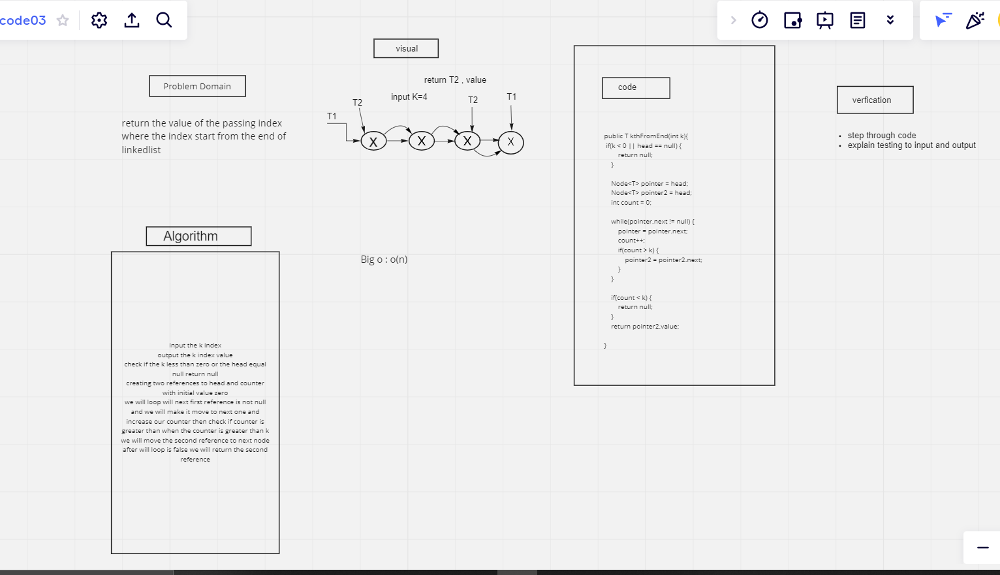

# data-structures-and-algorithms 

---

## Challenge Summary

---

## Linked List kth

create Linked list and get the value where places in k index from the tail of the linked list

---

## Whiteboard Process 

---

