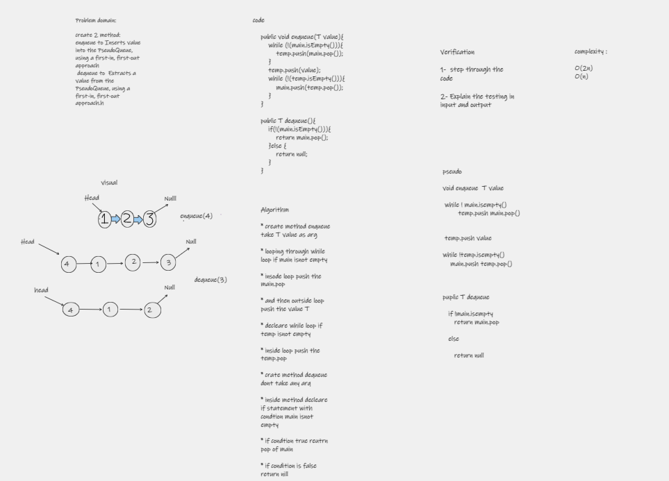

# enqueue and dequeue

---

## Challenge Summary : 

create 2 method: enqueue to Inserts value into the PseudoQueue, using a first-in, first-out approach
dequeue to  Extracts a value from the PseudoQueue, using a first-in, first-out approach.h 

## Whiteboard Process 

## Approach & Efficiency
 
  create 2 method enqueue and dequeue with big O 2n and n 

## Solution
