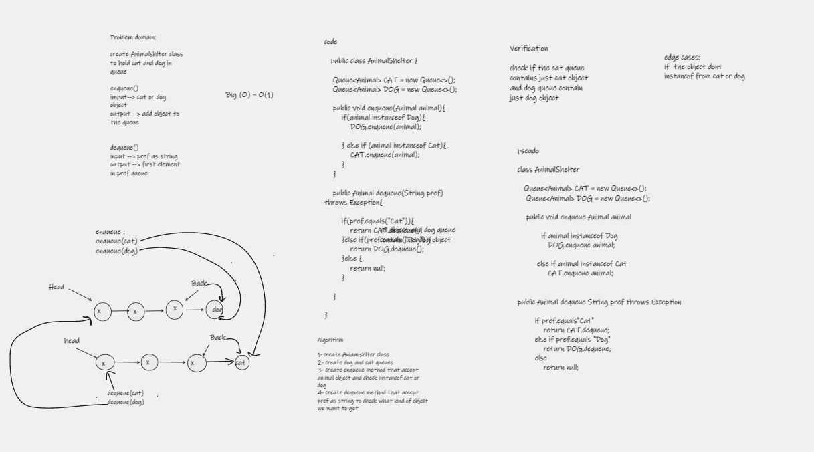

# stack-queue-animal-shelter

---

## Challenge Summary :

eate Animalshlter class to hold cat and dog in queue

enqueue()

imput--> cat or dog object

output --> add object to the queue

dequeue()

input --> pref as string

output --> first element in pref queue

## Whiteboard Process

## Approach & Efficiency

create 2 method enqueue and dequeue with big O(1)

## Solution
