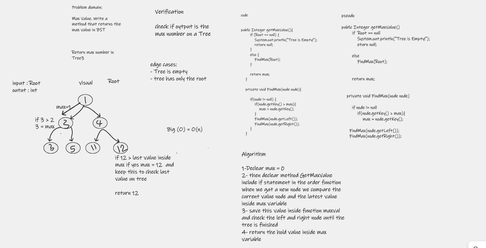

# Tree Max

---

# Challenge Summary

craete a Method for the Binary Tree class to find maximum value

## Whiteboard Process

## Approach & Efficiency

1-Declear max = 0

2- then declear method GetMaxValue include if statement in the order function when we gat a new node we compare the current value node and the latest value inside max variable

3- save this value inside function maxval and check the left and right node until the tree is finished  

4- return the hold value inside max variable

## Solution
<!-- Show how to run your code, and examples of it in action -->