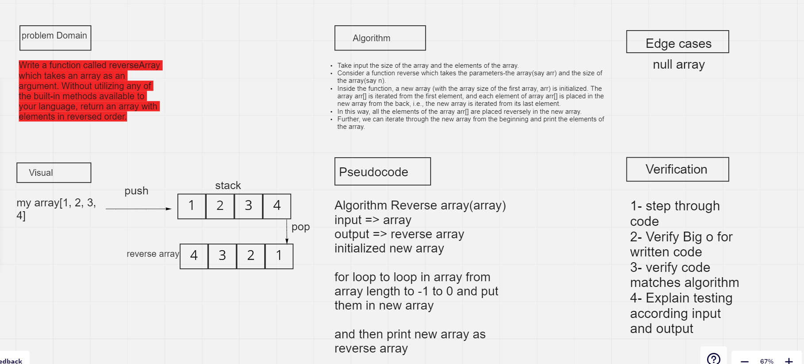

# data-structures-and-algorithms

# Reverse an Array

Take input the size of the array and the elements of the array.
Consider a function reverse which takes the parameters-the array(say arr) and the size of the array(say n).
Inside the function, a new array (with the array size of the first array, arr) is initialized. The array arr[] is iterated from the first element, and each element of array arr[] is placed in the new array from the back, i.e., the new array is iterated from its last element.
In this way, all the elements of the array arr[] are placed reversely in the new array.
Further, we can iterate through the new array from the beginning and print the elements of the array.

## Whiteboard Process

## Approach & Efficiency

