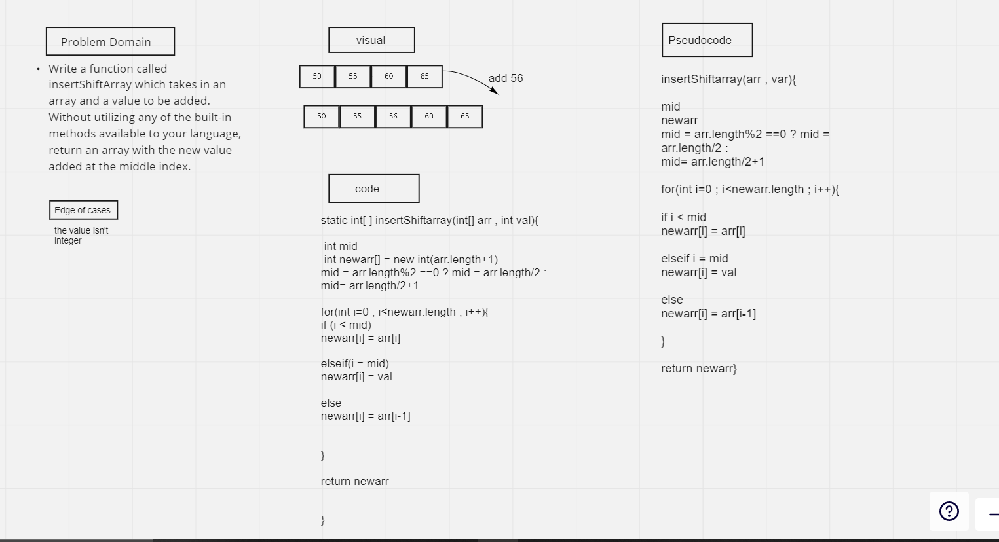

# data-structures-and-algorithms

# array insert shift 

# Insert to Middle of an Array

---
add value of middle in a given array

---

## Whiteboard Process

---

---

## Approach & Efficiency

---
I devied the length of array in vareable by tow and puted the value in that index