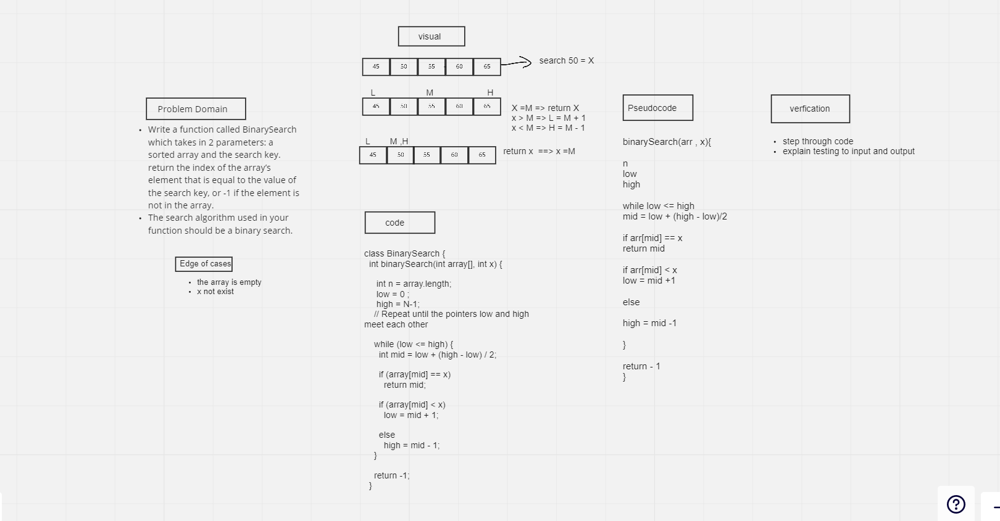

# data-structures-and-algorithms

# array-binary-search

# Binary Search of Sorted Array

---
Found value in array with using binary search tree 

---

## Whiteboard Process

---

---

## Approach & Efficiency

---
i defined  l => 0 , h => length - 1 , and mid of array